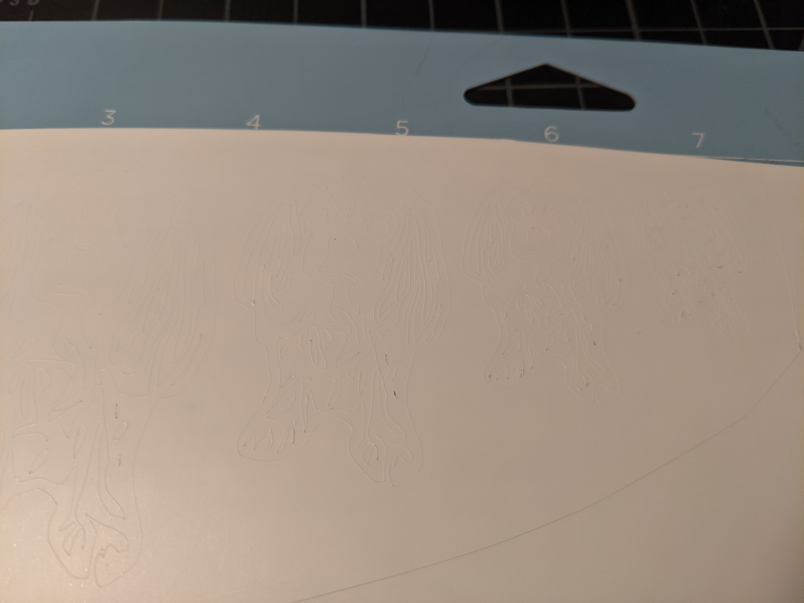
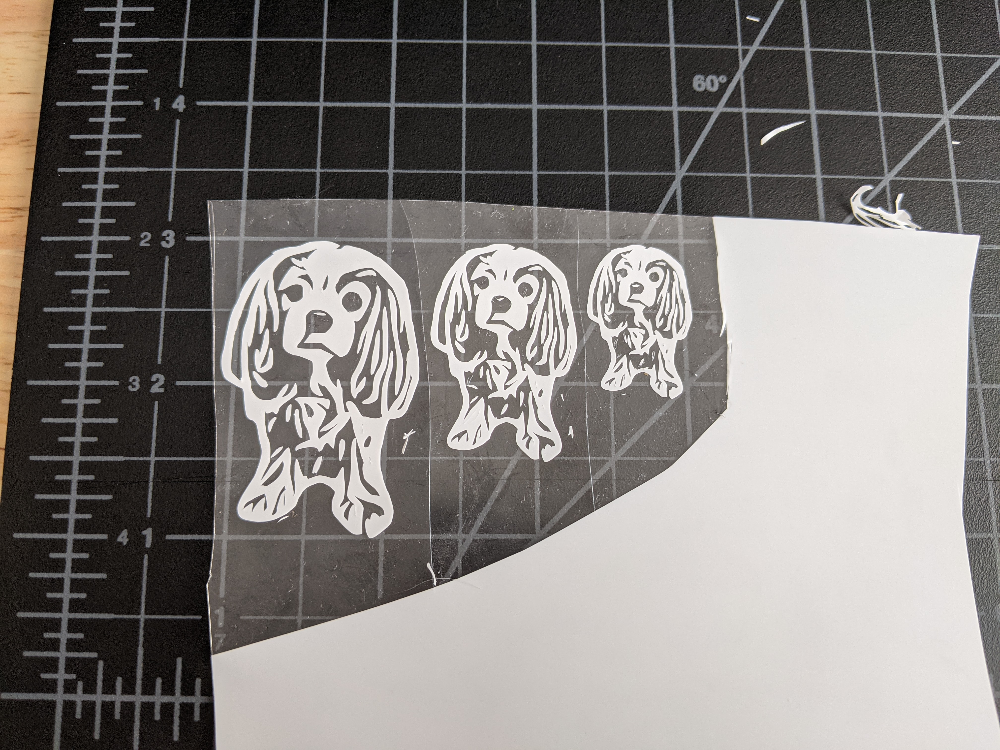

# Cavalier Decals

Purchased really cheap heat transfer vinyl and wanted to test its limits. Created a detailed design of my dog and printed at four different sizes (2in to .75 in). 

Outcome: It cut great, but weeding was harder due to the cheaper, less tacky adhesive on the roll compared to more expensive brands. The smaller two (sub 1 inch) lost a few details during weeding, but the transwer worked well and survived 10 washes/dries. The roll will work great for less detailed work- saving me ~$20/roll.  

Cutting was clean 
 

 
 

Note detail loss on the 1 inch decal
 

 
 

 
 Transfer after 10X washes
 

 
 

